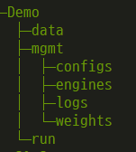

SoyNet은 AI Deep Learning 모델의 추론(inference) 전용 엔진이며 
NVIDIA와 non-NVIDIA 기반을 각각 CUDA, OpenCL 등의 기술기반으로 지원한다. 


### SoyNet의 핵심 기술은 다음과 같다. 
 - GPU 상의 수많은 core의 사용율을 극대화시키는데 있으며
 - GPU 메모리 사용량 최소화   
 

### SoyNet의 특장점
 - AI deep learning 모델을 이용하여 어플리케이션, 서비스를 하고자 하는 고객에게 최단의 Time-to-Market을 제공
 - 고객사가 자체 보유한 응용 어플리케이션 개발자의 AI 프로젝트 참여를 확대
 - 동일한 AI 실행(추론)을 위해 소요되는 장비 비용의 절감
 - 고도의 Tac-Time을 요구하는 실시간 환경에의 대응 지원
  
   
### SoyNet 특징
 - 제공형태는 library 파일 
   Windows는 dll, Linux는 so 파일 형태 (개발용 header와 lib는 별도)
 - 폴더 구성 
     

  ```
   ├─data         : 테스트 용 영상 파일 포함
   ├─mgmt         : SoyNet 실행환경
   │  ├─configs   : 모델정의 파일 (*.cfg)와 임시 라이선스키 포함 
   │  ├─engines   : SoyNet 실행 엔진 파일 생성 (최초 실행 시 1회. 30초 가량 소요)
   │  ├─logs      : SoyNet log 파일 폴더
   │  └─weights   : 테스트용 모델의 weight 파일포함 (변환 script을 이용하여 SoyNet용으로 변환된 것임)
   └─run          : 실행 파일을 포함한 폴더 
 ```

다음 글은 NVIDIA GPU 환경 하에서 
SoyNet을 이용하여 객체감지 모델 중 하나인 YOLOv4 모델을 이용한 
video 기반 데모 프로그램을 실행하는 과정을 설명한다.


### 사전 요구사항

1.H/W 
 - GPU : PASCAL 아키텍처 이상의 NVIDIA GPU 

2.S/W
 - 운영체제 : Ubuntu 18.04LTS
 - NVIDIA 개발환경 : CUDA 10.0 / cuDNN 7.x / TensorRT 6.0
 - 기타 : OpenCV 3.4.5 (영상 파일 읽고 화면 출력하기 위한 용도)

* 위에 언급된 실행환경 구성을 위한 so 파일들의 다운로드 링크는 다음과 같으며 
run 폴더 상에 복사하거나 다른 폴더 상에 두고 LD_LIBRARY_PATH 환경 변수 상에 해당 경로를 추가


### SoyNet 설치 구성 

1.실행환경 다운로드 


